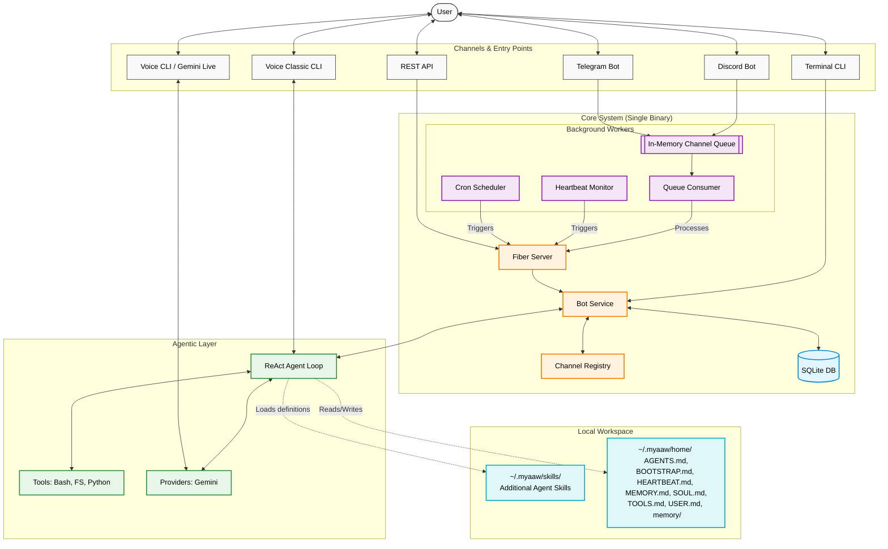

# 🔗 Myaaw (My AI Agent Well)

<div align="center">
  

  [](https://goreportcard.com/report/github.com/Shiyinq/myaaw)
  [](https://opensource.org/licenses/MIT)
  [](https://github.com/Shiyinq/myaaw)
  [](https://github.com/Shiyinq/myaaw/stargazers)

</div>

  **Myaaw is my personal AI assistant. You don't need to waste your time trying it out—I recommend sticking with your beloved [Hermes Agent](https://github.com/nousresearch/hermes-agent), [OpenClaw](https://github.com/openclaw/openclaw), or whatever else you use. Hmm, or maybe you can try [Pi Agent](https://github.com/earendil-works/pi).**

---

> **Note:** The details below are only for my personal reference and my AI Assistant. You really don't need to read this!

## ✨ Key Features
- [x] **Multimodal Input**: Supports Text, Voice (Transcribed), and Image input.
- [x] **Smart Responses**: Supports both Basic and Streamed responses for real-time interaction.
- [x] **Conversation Memory**: Remembers your chat history for natural flow.
- [x] **Agent Skills**: Dynamically extensible capabilities via `SKILL.md` definitions.
- [x] **Powerful Tools**: Native integration with Filesystem, Bash, and Python execution.
- [x] **Heartbeat (Autonomous Check)**: Scheduled background checks for health and tasks via `HEARTBEAT.md`.
- [x] **CLI Voice Chat**: Native support for Real-time Voice (Gemini Live) and Classic STT/TTS pipeline with screen/camera sharing via CLI.
- [x] **Single Binary & Zero Config**: Runs entirely locally using SQLite and Go Channels. No Docker or complex databases required!

## 🤖 Supported Providers

Myaaw currently focuses on delivering the best experience with **Google Gemini API**.


## 📡 Supported Channels

Myaaw can be integrated with various platforms:

- 📨 **Telegram**: Integration via Bot API (Polling or Webhook).
- 👾 **Discord**: Integration via Discord Bot.
- 💻 **Terminal**: Interactive TUI chat and CLI management.


# Table of Contents
- [✨ Key Features](#-key-features)
- [🤖 Supported Providers](#-supported-providers)
- [📡 Supported Channels](#-supported-channels)
- [🏗 Architecture](#-architecture)
- [🚀 Quick Start (Non-Technical)](#-quick-start-non-technical)
- [🛠 Development](#-development)
  - [Prerequisites](#prerequisites)
  - [Getting Started](#getting-started)
  - [Start Development](#start-development)
  - [Generate Swagger Documentation](#generate-swagger-documentation)
  - [Build from Source](#build-from-source-optional)
- [💻 Myaaw CLI Reference](#-myaaw-cli-reference)


## 🏗 Architecture

Myaaw follows a modular, single-binary architecture designed for simplicity and performance. It seamlessly handles multiple communication channels, in-memory queue processing, and a robust AI Agentic loop, backed entirely by SQLite.



### Key Components

1. **Channels (`internal/channel`)**: The entry point for interactions. It provides an `Adapter` interface to normalize messages from Telegram, Discord, REST APIs, or Terminal CLI into a standard format.
2. **Server & Workers (`cmd/myaaw`)**: Uses Cobra CLI to manage the application. The `server` command boots the Fiber v3 Web Server while simultaneously spinning up background goroutines for Queue Consumers, Cron, and Heartbeat. It also provides pure CLI modalities like `myaaw chat` and `myaaw voice`.
3. **Bot Service (`internal/services/bot`)**: The core brain of the application. It processes normalized messages from external channels and Terminal CLI, retrieves chat history from **SQLite**, and invokes the AI Agent. Voice CLIs (`myaaw voice`/`voice-classic`) bypass this to connect directly to the Agent/Providers for lower latency.
4. **Agentic Layer (`internal/agent`)**: Implements the ReAct (Reasoning and Action) loop. It intelligently decides when to interact with the LLM or when to execute tools (Bash, Python, FileSystem) to accomplish the user's objective.
5. **Providers (`internal/provider`)**: A factory-based abstraction layer for various LLMs (Gemini, OpenAI, Groq, Ollama), Transcribers (STT), and Synthesizers (TTS). Currently, Gemini is the main provider for Myaaw's intelligence and live-voice functionality.
6. **Message Queue (`internal/services/queue`)**: Handles asynchronous messaging using fast, native **Go Channels**. Polled or webhook payloads are pushed to the in-memory queue and processed by the Consumer worker to reliably deliver messages.
7. **Automation (`internal/cron`, `internal/heartbeat`)**: Background schedulers. The `cron` handles scheduled messages, while the `heartbeat` autonomously wakes up the agent at intervals to check `HEARTBEAT.md` for pending background duties.
8. **Local Workspace (`~/.myaaw`)**: The operational directory for the Agent.
   - `myaaw.db`: The local SQLite database holding user data and conversation history.
   - `skills/`: Dynamically parsed text definitions of new tools that Myaaw can learn and execute.
   - `home/`: Long-term file storage containing Myaaw's core definitions:
     - `AGENTS.md` / `SOUL.md`: Persona and behavior instructions.
     - `BOOTSTRAP.md` / `TOOLS.md`: Initialization steps and tool usage rules.
     - `USER.md`: Facts and details learned about the user.
     - `HEARTBEAT.md`: Ongoing active background jobs and tasks.
     - `MEMORY.md` & `memory/`: Historical conversation summarizations and logs.

## 🚀 Quick Start (Non-Technical)

If you just want to use Myaaw without worrying about code, use our interactive installer script!

1.  **Install Myaaw**: Open your terminal (Mac/Linux/Git Bash) and run:
    ```bash
    curl -fsSL https://raw.githubusercontent.com/Shiyinq/myaaw/main/install.sh | bash
    ```
    *This will automatically download the correct binary for your OS and start the onboarding process.*
2.  **Onboard**: If you skipped the installation script, you can trigger onboarding anytime:
    ```bash
    myaaw onboard
    ```
3.  **Launch the Server**:
    ```bash
    myaaw server start
    ```
4.  **Check Status**:
    ```bash
    myaaw status
    ```


## 🛠 Development


### Prerequisites

Before you start, ensure you have:
- [Go](https://go.dev/) **1.23.0** or later installed.

#### 🎤 Voice Feature Requirements (CGo)
The `myaaw voice` feature relies on native system libraries for audio (PortAudio) and screen/camera capture. If you are building from source, you must install these dependencies:

**macOS**
```bash
brew install pkg-config portaudio
```
*Note: macOS will prompt for Microphone, Screen Recording, and Camera permissions upon first use.*

**Linux (Ubuntu/Debian)**
```bash
sudo apt update
sudo apt install -y portaudio19-dev libasound2-dev pkg-config
# For screen/camera capture:
sudo apt install -y libx11-dev libxext-dev
```

**Windows**
Building with CGo on Windows requires a C compiler environment like MSYS2/MinGW:
1. Install [MSYS2](https://www.msys2.org/).
2. Open MSYS2 MinGW 64-bit terminal and run:
   ```bash
   pacman -S mingw-w64-x86_64-gcc mingw-w64-x86_64-portaudio
   ```

### Getting Started

1. **Clone the Repository**
   ```bash
   git clone https://github.com/Shiyinq/myaaw.git
   cd myaaw
   ```

2. **Install Dependencies**
   ```bash
   go mod tidy
   ```

3. **Onboard (Dev Mode)**
   Since you have the source code, you can run the onboarding flow directly:
   ```bash
   go run ./cmd/myaaw onboard
   ```

### Start Development

Once everything is set up, you can start the gateway using **one** of the following methods:

#### Option A: Direct Execution (Standard)
```bash
go run ./cmd/myaaw server start
```

#### Option B: Live Reload (Recommended for Dev)
If you want the server to restart automatically when you change the code, use [Air](https://github.com/air-verse/air). 

1. Install it globally (first time only):
   ```bash
   go install github.com/air-verse/air@latest
   ```
2. Run it in the root directory:
   ```bash
   air
   ```

---

**Monitor Status & Logs**:
In a separate terminal, you can monitor the server:
```bash
go run ./cmd/myaaw status
go run ./cmd/myaaw logs
```

> [!NOTE]
> These commands only track services started via **Option A**. 
> If you are using **Option B (Air)**, the status and logs will appear directly in the same terminal where the `air` command is running.

---

### Generate Swagger Documentation

Swagger documentation is automatically updated every time you run `make build` or `make install`.

1. **Manual Update**
   If you only want to update the documentation without building:
   ```bash
   make swagger
   ```

2. **Accessing the UI**
   Once the server is running, the interactive documentation is available at:
   `http://localhost:8080/docs/index.html`


### Build from Source (Optional)

If you want to build the Myaaw binaries yourself (e.g., for distribution or custom versions), you can use the provided `Makefile`:

1.  **Build for current platform**:
    ```bash
    make build
    ```
2.  **Cross-compile for all platforms**:
    ```bash
    make build-all
    ```
    *Note: Due to PortAudio's CGO requirements, cross-compilation via `make build-all` requires external C-compilers to be installed on your host machine. Alternatively, you can rely on the automated GitHub Actions pipeline which builds natively across OS runners.*


## 💻 Myaaw CLI Reference

The `myaaw` CLI is your control center for managing the AI assistant, infrastructure, and services. You can run these commands via `go run ./cmd/myaaw` (Development) or simply `myaaw` (if installed globally).

### 🛠️ Getting Started
| Command | Description |
| :--- | :--- |
| `onboard` | Interactive setup for first-time users (Keys and Channels). |

### 🐱 Core Interaction
| Command | Description |
| :--- | :--- |
| `chat` | Start an interactive TUI chat session with Myaaw. Use `-m "text"` for one-shot. |
| `voice` | Start a real-time voice conversation (Gemini Live). Use `--video=screen,camera` to stream vision. |
| `voice-classic` | Voice chat using STT → Agent → TTS pipeline. Supports tools. Use `--video=screen,camera` to stream vision.|
| `status` | Check the health of SQLite and channel configs. |
| `logs` | Interactive TUI to select and stream logs from `~/.myaaw/logs/`. |

### 🚀 Service Management
Myaaw runs as a unified background service daemon.

| Command | Subcommands | Description |
| :--- | :--- | :--- |
| **`server`** | `run`, `start`, `stop`, `status` | Manage the Myaaw Server (API + Background Workers) daemon. |
| **`webhook`** | `set`, `info`, `delete` | Manage Telegram bot webhook configuration easily. |

> [!TIP]
> Use `myaaw server run` for foreground execution (useful for debugging) and `myaaw server start` for background daemon execution.

### ⏰ Cron Scheduler & Tasks
Myaaw includes a built-in scheduler to automate tasks (like sending recurring messages or reminders).

| Command | Subcommands | Description |
| :--- | :--- | :--- |
| **`cron`** | `list` | View all scheduled jobs in a neat table. |
|  | `add` | Create a new job (supports cron expression, interval, or one-time `at`). |
|  | `remove` | Delete a scheduled job by ID. |
|  | `run` | Manually trigger a specific job immediately. |
|  | `history` | View execution logs (success/fail/skipped) for a job or globally. |

**Examples:**
```bash
# Every morning at 7 AM
myaaw cron add --name "Morning Greeting" --cron "0 7 * * *" --message "Selamat Pagi!" --channel telegram --to 123456789

# Every 2 hours
myaaw cron add --name "Hydration Check" --every "2h" --message "Drink water!" --channel telegram --to 123456789

# One-time reminder in 30 minutes
myaaw cron add --name "Meeting Remind" --at "30m" --message "Meeting in 30 mins" --channel telegram --to 123456789
```

### ⚙️ System & Config
| Command | Subcommands | Description |
| :--- | :--- | :--- |
| **`config`** | `check`, `dump` | Validate your `.env` or print current configuration (masked). |
| **`completion`** | `bash`, `zsh`, `fish`, `ps` | Generate autocompletion scripts for your shell. |
| **`help`** | `[command]` | Display help information for Myaaw or any specific command. |
| **`update`** | - | Automatically check for and install the latest version via GitHub Releases. |
| **`version`** | - | Show build version, commit hash, and system info. |
